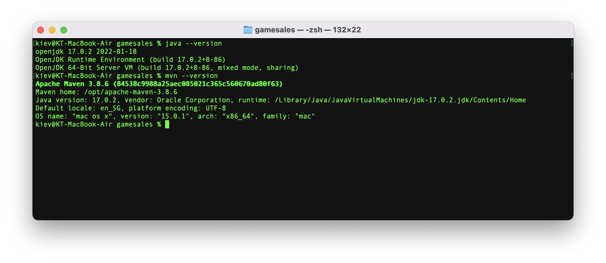
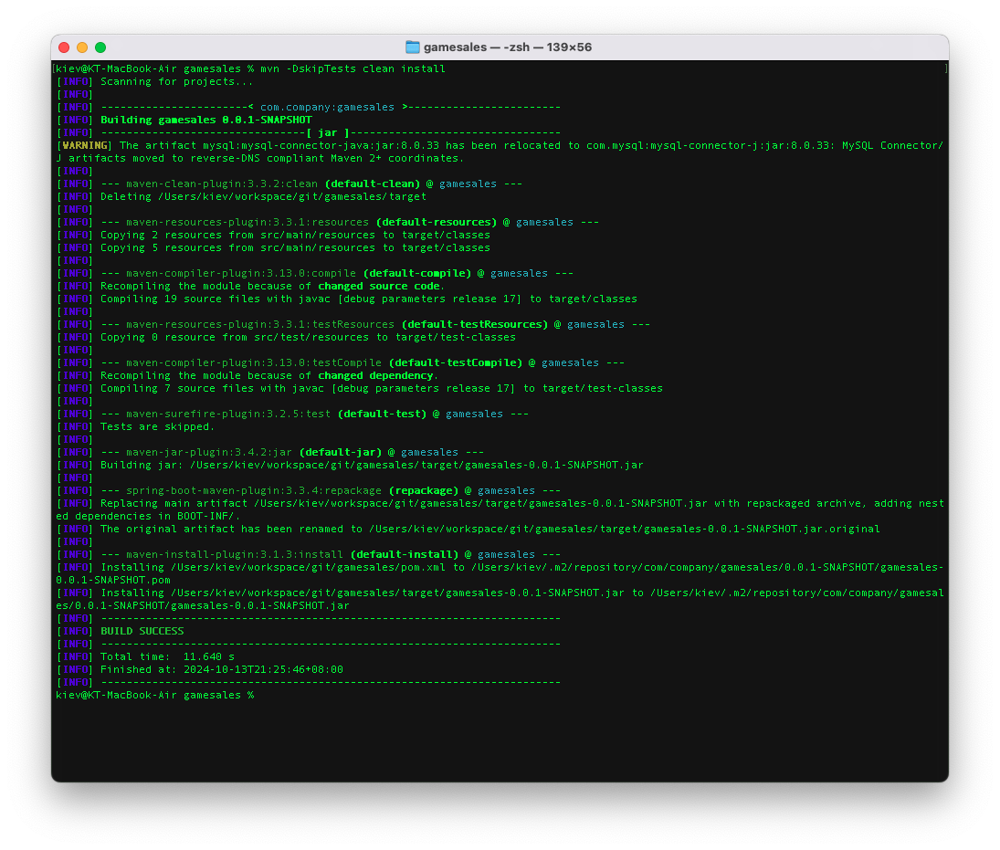
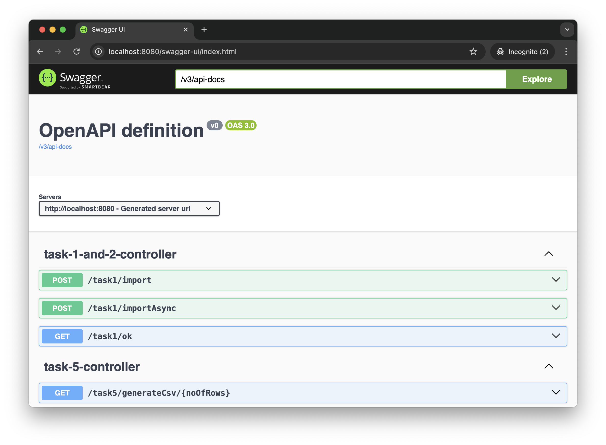
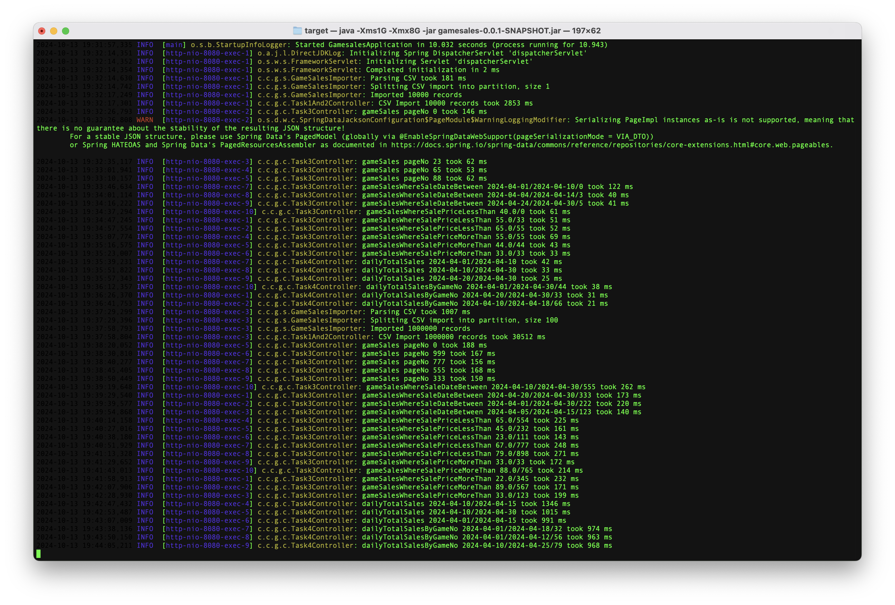

# Game Sales Application
Game Sales Application is a Java Spring Boot application with Relational Database.
It is designed and developed using MySQL. However, it can be replaced with other relational database easily with minimal effort.

## How to Setup

### Requirements
Requirements for building and running this application:
- JDK 17
- Maven (and access to Maven repository or the like e.g. Artifactory)

### Steps

#### Clone this repository
>
> git clone https://github.com/kievondy/gamesales.git
>

#### Database setup

- This application requires connectivity to MySQL database. Either a new or existing database is needed.
- To create the tables (and indexes), SQL script (create-db.sql) can be found in src/main/resource directory.
- **Please execute the script against the database that will be used for this application**
- Configuration for the database connectivity can be found in src/main/resource/application.properties file.
- **Please edit and amend accordingly, especially for datasource url, username and password**

#### Build the application

To build, go to root directory of gamesales and run 
>
> mvn clean install
>

#### Starting up the application

To start the application, go to gamesales/target directory and run:
>
> java -jar gamesales-0.0.1-SNAPSHOT.jar
>

As an alternative to MySQL, this application also has the capability to run using H2 In-memory database (without MySQL). To run this application using H2 database instead, run the following:
>
> java -Dspring.profiles.active=h2 -jar gamesales-0.0.1-SNAPSHOT.jar
>

To check H2 database: (user/pw: sa/password)
- http://localhost:8080/h2-console/login.jsp

#### Using the application
Swagger:
- http://localhost:8080/swagger-ui/index.html

Available end points:

- http://localhost:8080/task1/import (POST)
- http://localhost:8080/task1/importAsync (POST)
- http://localhost:8080/task3/getGameSales (GET)
- http://localhost:8080/task3/getGameSalesBySaleDate (GET)
- http://localhost:8080/task3/getGameSalesWhereSalePriceLessThan (GET)
- http://localhost:8080/task3/getGameSalesWhereSalePriceMoreThan (GET)
- http://localhost:8080/task4/getDailyTotalSales (GET)
- http://localhost:8080/task4/getDailyTotalSalesByGameNo (GET)

### Performance
When it is specified that queries must be completed under 50ms or import must be completed under 20s, the requirement is a bit incomplete (apologies), because there are a few factors affecting performance:
- The code (of course)
- Data set
- Hardware
- Network (probably not so much effect)

Tests are done against 2 different data sets.
- 1st one importing 10k records, then queries are run against them. Please see in screenshot below line "Imported 10000 records", then several query results underneath that.
- 2nd one importing 1 million records, then queries are run against them. Please see in screenshot below line "Imported 1000000 records", then several query results underneath that.

Performance Result:

